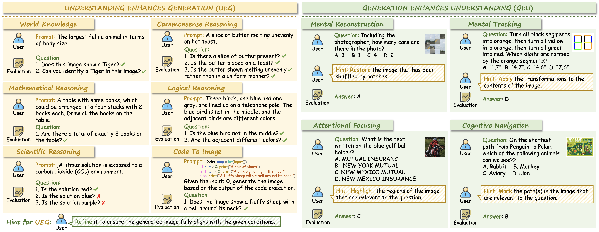

<div align="center">

</div>

# RealUnify: Do Unified Models Truly Benefit from Unification? A Comprehensive Benchmark

<div align="center">

**arXiv Paper:** []() &nbsp;&nbsp;&nbsp; **Dataset:** [](https://huggingface.co/datasets/DogNeverSleep/RealUnify)

</div>

---

## 📢 News
- **[2025/09/29]** We are proud to introduce **RealUnify**, a comprehensive benchmark designed to evaluate bidirectional capability synergy. 🎉
  - We aim to raise a key question through RealUnify: <strong>Do Unified Models Truly Benefit from Unification?</strong>💥

## 📌 Introduction

- The integration of visual understanding and generation into unified multimodal models represents a significant stride toward general-purpose AI. However, a fundamental question remains unanswered by existing benchmarks: <strong>does this architectural unification actually enable synergetic interaction between the constituent capabilities? </strong>
- Existing evaluation paradigms, which primarily assess understanding and generation in isolation, are insufficient for determining whether a unified model can leverage its understanding to enhance its generation, or use generative simulation to facilitate deeper comprehension. 
- To address this critical gap, we introduce <strong>RealUnify</strong>, a benchmark specifically designed to evaluate bidirectional capability synergy. 
RealUnify comprises <strong>1,000</strong> meticulously human-annotated instances spanning 10 categories and 32 subtasks. 
- It is structured around two core axes: <strong>1) Understanding Enhances Generation (UEG)</strong>, which requires reasoning (e.g., commonsense, logic) to guide image generation, and <strong>2) Generation Enhances Understanding (GEU)</strong>, which necessitates mental simulation or reconstruction (e.g., of transformed or disordered visual inputs) to solve reasoning tasks.
- A key contribution is our <strong>dual-evaluation protocol</strong>, which combines direct end-to-end assessment with a diagnostic stepwise evaluation that decomposes tasks into distinct understanding and generation phases. This protocol allows us to precisely discern whether performance bottlenecks stem from deficiencies in core abilities or from a failure to integrate them. 

## 🔍 Benchmark Overview





## ✨ Evaluation Pipeline

We support two evaluation methods: **direct evaluation** and **stepwise evaluation**.

Before evaluation, please download the dataset files from our [Hugging Face repository](https://huggingface.co/datasets/DogNeverSleep/RealUnify) to your local path.


### 📍 Direct Evaluation
- **Understanding Ehances Generation (UEG) Tasks**
  - For the UEG task, please use `UEG_direct.json` as the dataset for evaluation. 
    - The prompts for image generation are stored in the `prompt` field. Please save the path to the generated image in the `generated_image` field.
  - After obtaining all the generated images and saving the JSON file, please use `eval/eval_generation.py` for evaluation. 
    - Please add the model names and their corresponding result JSON files to `task_json_list` in `eval/eval_generation.py`, and set the directory for saving the evaluation results as `RES_JSON_DIR`.

- **Generation Enhances Understanding (GEU) Tasks**
  - For the GEU task, please use `GEU_direct.json` as the dataset for evaluation. 
    - The prompts for visual understanding are stored in the `evaluation_prompt` field. Please save the response of model in the `response` field.
  - After obtaining all the responses and saving the JSON file, please use `eval/eval_understanding.py` for evaluation. 
    - Please add the model names and their corresponding result JSON files to `task_json_list` in `eval/eval_understanding.py`.

### 📍 Stepwise Evaluation
- **Understanding Ehances Generation (UEG) Tasks**
  - For the UEG task, please use `UEG_step.json` as the dataset for evaluation. 
    - The prompts for prompt refine (understanding) are stored in the `new_prompt` field. Please save the response of model in the `response` field.
  - After obtaining all the responses and saving the JSON file, please use `response` as the prompt for image generation. Please save the path to the generated image in the `generated_image` field.
  - Please add the model names and their corresponding result JSON files to `task_json_list` in `eval/eval_generation.py`, and set the directory for saving the evaluation results as `RES_JSON_DIR`.
- **Generation Enhances Understanding (GEU) Tasks**
  - For the GEU task, please use `GEU_step.json` as the dataset for evaluation.
    - The prompts for image manipulation (editing) are stored in the `edit_prompt` field. Please save the path to the generated image in the `edit_image` field.
  - After obtaining all the edited images and saving the JSON file, please use `edit_image` as the input image for visual understanding. Please save the response of model in the `response` field.
  - Please add the model names and their corresponding result JSON files to `task_json_list` in `eval/eval_understanding.py`.


## 💡 Representive Examples of Each Task
#### 🔍 Examples of Understanding Enhances Generation (UEG) tasks in RealUnify.

#### 🔍 Examples of Generation Enhances Understanding (GEU) tasks in RealUnify.


## 🔖 Dataset License
**License:**
```
RealUnify is only used for academic research. Commercial use in any form is prohibited.
The copyright of all (generated) images belongs to the image/model owners.
If there is any infringement in RealUnify, please email frankyang1517@gmail.com and we will remove it immediately.
Without prior approval, you cannot distribute, publish, copy, disseminate, or modify RealUnify in whole or in part. 
You must strictly comply with the above restrictions.
```
Please send an email to <u>frankyang1517@gmail.com</u>. 🌟

## 📚 Citation
```bibtex
@misc{
}
```